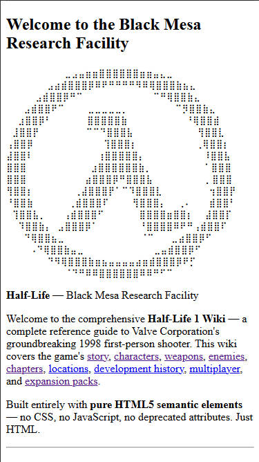

# Half-Life 1 Wiki — Pure HTML5 Edition

A complete Half-Life 1 wiki built with **pure HTML5 semantic elements**.
No CSS, no JavaScript, no deprecated attributes. Just HTML.

**46 HTML pages** covering the story, characters, weapons, enemies, chapters, locations, development, multiplayer, and expansions of Valve's 1998 masterpiece.

## Screenshots



*Home page with Black Mesa ASCII art logo and site navigation.*

## The Challenge

This project explores the limits of what's achievable with HTML alone:

- **Semantic structure**: `<header>`, `<nav>`, `<main>`, `<article>`, `<section>`, `<aside>`, `<footer>`
- **Visual interest via HTML**: `<details>`/`<summary>`, `<figure>`/`<figcaption>`, `<pre>`, `<blockquote>`, `<mark>`, Unicode
- **SEO**: meta tags, Open Graph, Twitter Cards, JSON-LD structured data
- **Performance**: minimal HTML, no render-blocking resources, immediate content paint

## Pages

| Category | Files | Description |
|----------|-------|-------------|
| Main | `index.html`, `story.html` | Home page, full plot summary |
| Characters | 3 pages (index + 2 profiles) | Gordon Freeman, G-Man |
| Weapons | 15 pages (index + 14 weapons) | Crowbar to Gluon Gun |
| Enemies | 15 pages (index + 14 enemies) | Headcrab to Nihilanth |
| Chapters | 7 pages (index + 6 chapters) | Black Mesa Inbound to Blast Pit |
| Locations | `locations.html` | Black Mesa sectors, Xen |
| Other | `development.html`, `multiplayer.html`, `expansions.html` | History, modding, expansions |

## Structure

```
half-life-wiki-html/
├── index.html              # Home page
├── story.html              # Full plot
├── characters.html         # Character index
├── weapons.html            # Weapon index
├── enemies.html            # Enemy index
├── chapters.html           # Chapter list
├── locations.html          # Location guide
├── development.html        # Development history
├── multiplayer.html        # Multiplayer & modding
├── expansions.html         # Opposing Force, Blue Shift, Decay
├── characters/             # Character profiles
├── weapons/                # Weapon details (14 pages)
├── enemies/                # Enemy details (14 pages)
├── chapters/               # Chapter guides (6 pages)
├── README.md
└── .gitignore
```

## Usage

Open any `.html` file in a browser. No server required.

## License

MIT
